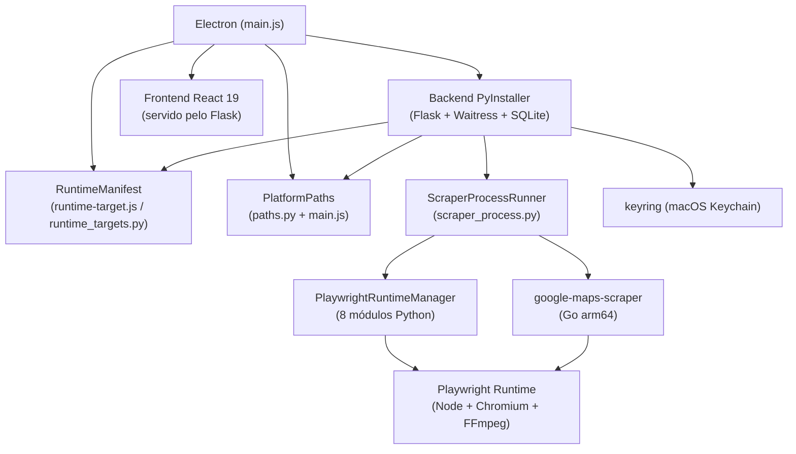

# ProspectOS Multiplataforma

## Visão geral

ProspectOS é uma aplicação desktop de prospecção de leads com Electron + React 19
(frontend) + Flask 3.1 (backend) + SQLite. O backend utiliza sidecars externos:
um scraper Go (Google Maps via Playwright) e o runtime Playwright (Node + Chromium).

Originalmente Windows-only, esta iniciativa adapta o ProspectOS para executar
nativamente em **macOS Apple Silicon (darwin-arm64)**, preservando a compatibilidade
com Windows e preparando a arquitetura para Linux no futuro.

**Escopo:** build e execução local no Mac do desenvolvedor. Não inclui distribuição
pública, assinatura, notarização ou Mac Intel neste momento.

**Validado em:** 2026-07-20 — MacBook Apple M4, macOS 26.4, Python 3.14.5,
Node 22.22.2, Electron 38.2.0.

---

## Estado original (branch `main` @ `bebc2f1`)

| Componente | Estado original | Limitação |
|---|---|---|
| Electron | Windows build | `electron-builder.yml` só target `win`, `main.js` hardcoded `.exe` |
| Backend | `ProspectOS.exe` nome hardcoded | `main.js:39,42` e `prospectos.spec:31,36` |
| Scraper | `google-maps-scraper.exe` hardcoded | `jobs.py:315` sem resolução por plataforma |
| Node | `node.exe` + fallback `C:\Program Files\` | `jobs.py:436,442` |
| Dados | `%APPDATA%` | `main.js:46`, `paths.py:33` |
| Credenciais | `keyring.backends.Windows` | `prospectos.spec:45` sem backend macOS |
| PyInstaller | spec Windows | só `.exe` references |
| Scripts | `.bat` e `.ps1` | dev workflow Windows-only |
| Ícone | `.ico` | sem `.icns` |

---

## Arquitetura atual (branch `develop` @ `b900821`)



### Fluxo de startup

1. Electron inicia, `main.js:56` resolve paths via `app.getPath()` e env vars
2. `runtime-target.js:180` carrega `runtime-targets.json` e resolve o target atual
3. Electron spawna o backend PyInstaller com env vars `PROSPECTOS_*`
4. Backend lê `paths.py`, configura diretórios, inicializa banco SQLite + keyring
5. Backend escreve `LISTENING_ON=PORTA` no stdout
6. Electron detecta porta, faz readiness check HTTP, carrega frontend
7. Na primeira busca Maps, `scraper_runtime.py` aciona `PlaywrightRuntimeManager`
8. PRM baixa Node + playwright-core + Chromium (download sob demanda, ~938MB)
9. `ScraperProcessRunner` executa scraper Go com ambiente controlado
10. Progresso lido de stderr, convertido em eventos, enviado ao frontend

---

## Estado da iniciativa

### PR/Fase 0 — Dependências Python

| Campo | Valor |
|---|---|
| **Status** | **BLOQUEADO** — commit `42c9040` foi revertido no HEAD |
| Commit | `42c9040` (original, requests 2.32.3 -> 2.34.2) |
| Arquivo | `backend/requirements.txt` |
| Evidência | `git diff 42c9040 HEAD -- backend/requirements.txt` confirma reversão |
| Validação | `pip install -r requirements.txt` em venv vazio: **ResolutionImpossible** |
| Risco | `instagrapi 2.18.3` exige `requests>=2.34.2`, pin atual `2.32.3` é impossível de resolver |
| Ação | Reaplicar bump para `requests==2.34.2` |

### PR/Fase 1 — PlatformPaths

| Campo | Valor |
|---|---|
| **Status** | **COMPLETO** |
| Commit | `78badc4` |
| Arquivos | `backend/paths.py`, `backend/app.py`, `desktop/main.js`, `tests/test_paths.py` |
| Evidência | 516 linhas adicionadas, testes passando, env vars funcionais |

**Paths por plataforma:**

| Finalidade | macOS | Windows | Linux |
|---|---|---|---|
| Dados | `~/Library/Application Support/ProspectOS` | `%APPDATA%\ProspectOS` | `$XDG_DATA_HOME/ProspectOS` |
| Logs | `~/Library/Logs/ProspectOS` | `%APPDATA%\ProspectOS\logs` | `$XDG_DATA_HOME/ProspectOS/logs` |
| Cache | `~/Library/Caches/ProspectOS` | `%LOCALAPPDATA%\ProspectOS\cache` | `$XDG_CACHE_HOME/ProspectOS` |
| Temp | `$TMPDIR/ProspectOS` | `%TMP%\ProspectOS` | `/tmp/ProspectOS` |

**Precedência:**
1. `PROSPECTOS_DATA_DIR` / `PROSPECTOS_LOG_DIR` / `PROSPECTOS_CACHE_DIR` / `PROSPECTOS_TEMP_DIR` / `PROSPECTOS_RESOURCE_DIR` (env var)
2. Electron `app.getPath()` (modo empacotado)
3. Fallback nativo por plataforma

### PR/Fase 2 — RuntimeManifest

| Campo | Valor |
|---|---|
| **Status** | **COMPLETO** |
| Commit | `55f92b0` |
| Arquivos | `shared/runtime-targets.json`, `backend/runtime_targets.py`, `desktop/runtime-target.js`, testes |
| Evidência | 1407 linhas adicionadas, 9 arquivos, testes passando |

**Targets canônicos:**
- `darwin-arm64` (Apple Silicon)
- `darwin-x64` (Intel Mac) — contrato apenas, sem build ou testes
- `win32-x64` (Windows)
- `linux-x64` (Linux) — contrato apenas, sem build ou testes

**Schema manifesto:**
```json
{
  "schemaVersion": 1,
  "targets": {
    "darwin-arm64": {
      "backend": { "name": "backend/ProspectOS" },
      "scraper": { "name": "scraper/google-maps-scraper" }
    }
  }
}
```

### PR/Fase 3 — PlaywrightRuntimeManager

| Campo | Valor |
|---|---|
| **Status** | **COMPLETO** |
| Commit | `dc0a9ce` |
| Arquivos | 22 novos, 4058 linhas adicionadas |
| Evidência | 8 módulos Python, CLI técnica, 160+ testes unitários |

**Componentes:**
- `downloader.py` — download com checksums e retry
- `errors.py` — 12+ tipos de erro específicos
- `extractor.py` — extração segura de `.tgz`
- `lock.py` — lock atômico via sistema de arquivos
- `manager.py` — orquestrador principal (893 linhas)
- `manifest.py` — manifesto de instalação
- `models.py` — dataclasses de estado
- `validator.py` — validação de integridade

**Limitação:** spec só tem runtime para `darwin-arm64`. `darwin-x64` e `linux-x64`
não possuem entrada em `playwright-runtime-targets.json`, portanto o
`PlaywrightRuntimeManager` lança `UnsupportedTargetError` para esses targets.

### PR/Fase 4 — Integração do scraper

| Campo | Valor |
|---|---|
| **Status** | **COMPLETO** |
| Commit | `35cde07` |
| Arquivos | `scraper_process.py`, `scraper_runtime.py`, `jobs.py`, testes |
| Evidência | 1195 linhas adicionadas, smoke real darwin-arm64 |

**Detalhes:**
- `ScraperProcessRunner`: lê stdout+stderr concorrentemente, progresso via callbacks,
  timeout, SIGTERM com grace period, SIGKILL como fallback
- `scraper_runtime.py`: bridge que resolve scraper + prepara runtime Playwright
- Leitura de progresso do **stderr** (compatível com scraper v1.16.3)

### PR/Fase 5 — Backend PyInstaller macOS

| Campo | Valor |
|---|---|
| **Status** | **PARCIAL** — artefato histórico existe, mas não reproduzível do HEAD |
| Commit | `c2e1e12` |
| Artefato | `backend/dist/ProspectOS/` (95 MB, 262 arquivos) — Mach-O arm64 |
| Evidência | Mach-O 64-bit executable arm64, sem dependências Homebrew |

**Spec:** `--onedir`, platform-conditional hidden imports, frontend/dist incluído,
manifesto runtime incluído, keyring macOS incluso.

**Script:** `scripts/build_backend.py` com flags `--clean`, `--skip-frontend`,
`--dist-dir`, `--work-dir`.

### PR/Fase 6 — Electron macOS

| Campo | Valor |
|---|---|
| **Status** | **PARCIAL** — artefato histórico existe, mas não reproduzível do HEAD |
| Commit | `c254a83` |
| Artefato | `desktop/saida/mac-arm64/ProspectOS.app` |
| Evidência | Todos 3 executáveis são Mach-O arm64, mas smoke real nunca foi executado |

**Artefato verificado:**
- `ProspectOS.app/Contents/MacOS/ProspectOS` — Mach-O 64-bit executable arm64
- `Resources/backend/ProspectOS` — Mach-O 64-bit executable arm64
- `Resources/scraper/google-maps-scraper` — Mach-O 64-bit executable arm64
- `Resources/shared/runtime-targets.json` — presente
- `Resources/shared/playwright-runtime-targets.json` — presente

**Script:** `scripts/build_desktop.py` — orquestrador completo (7 passos).

---

## Lacunas entre planejamento e implementação

| Item | Planejado | Implementado | Evidência | Ação |
|---|---|---|---|---|
| **CORE-001** requests bump | `2.34.2` | `2.32.3` (revertido) | `git diff 42c9040 HEAD`, `pip install` falha | Reaplicar bump |
| **MAC-001/002** builds | Reproduzível do HEAD | Artefato histórico apenas | `pip install` quebra antes de buildar | Corrigir CORE-001 primeiro |
| **Scraper arm64** | Binário no bundle | Compilado e incluso | `file` no .app | OK |
| **Playwright Runtime** | Download gerenciado | `PlaywrightRuntimeManager` | 160+ testes | OK |
| **darwin-x64** | Target no manifesto | Só contrato JSON | `runtime-targets.json` | FORA DE ESCOPO agora |
| **linux-x64** | Target no manifesto | Só contrato JSON | `runtime-targets.json` | FORA DE ESCOPO agora |
| **Windows build** | Preservado | Config estática, sem build real | `electron-builder.yml` win target | Pendente (Fase 3) |
| **Distribuição pública** | DMG, assinatura, notarização | Nada implementado | Auditoria original | FORA DE ESCOPO agora |
| **Keyring macOS smoke** | Validado em /tmp | Gate 1 comprovou | GATE1_RUNTIME_M4.md | Repetir no .app |
| **Frontend docs** | Texto dinâmico | Ainda cita `.exe` | `FaqDoc.tsx`, `GoogleMapsDoc.tsx` | Atualizar |

---

## Build e validação (comandos reais)

### Dependências

```bash
# Backend (BLOQUEADO — reque CORE-001 resolvido primeiro)
python3 -m venv .venv
source .venv/bin/activate
pip install --upgrade pip setuptools wheel
pip install -r backend/requirements.txt  # FALHA: ResolutionImpossible

# Frontend
cd frontend && npm ci

# Desktop
cd desktop && npm ci
```

### Testes

```bash
# Backend (pytest)
cd backend && python -m pytest -v

# Desktop (Node test)
cd desktop && npm test  # testa runtime-target.js
```

### Build backend (PyInstaller)

```bash
python scripts/build_backend.py --clean
python scripts/build_backend.py --skip-frontend  # se frontend/dist já existe
```

### Build desktop (Electron .app)

```bash
python scripts/build_desktop.py  # orquestrador completo (7 passos)
python scripts/build_desktop.py --skip-scraper  # se scraper já foi compilado
python scripts/build_desktop.py --clean         # limpa tudo antes
```

### Diagnóstico

```bash
# CLI do Playwright Runtime
python -m backend.tools.playwright_runtime_cli --help
python -m backend.tools.playwright_runtime_cli inspect
python -m backend.tools.playwright_runtime_cli diagnostics
python -m backend.tools.playwright_runtime_cli validate --full
```

### Comandos ainda não implementados

- Testes E2E do Electron empacotado: **não implementado**
- Smoke test automatizado do `.app`: **não implementado**
- Build Windows CI: **não implementado**
- Build Linux: **não implementado**

---

## Riscos

### Crítico (P0)
- `requirements.txt` quebrado impede instalação, desenvolvimento e CI
- Condicional `target == "darwin-arm64"` em `jobs.py` cria bifurcação de fluxo
- Nenhum workflow CI — todos os builds e testes são manuais

### macOS
- `.app` nunca foi executado como aplicativo — só validado estaticamente
- Runtime Playwright nunca foi testado dentro do `.app` empacotado
- Keychain em bundle PyInstaller nunca foi testado (só em `/tmp`)
- Node.js do sistema referenciado em manifestos (não usado, mas confunde)
- Nenhum teste de isolamento (sem Python/Node/Go no PATH)

### Windows
- Build Windows não foi executado desde as mudanças de paths/manifest
- Scripts `.bat` e `.ps1` obsoletos para o novo fluxo
- Dados existentes em `%APPDATA%\ProspectOS` precisam manter compatibilidade

### Linux
- Apenas contrato no manifesto (`linux-x64`)
- `keyring.backends.SecretService` no spec mas nunca testado
- Sem build, sem smoke, sem suporte real

---

## Próximas ações imediatas

### 1. Verificar CORE-001 (P0)

**Objetivo:** Confirmar se `requests==2.34.2` está no HEAD e `pip install` funciona.
**Por que agora:** Todos os builds Python dependem disso. Sem isso, nada reproduzível.
**Validação em 2026-07-20:** `pip install` falha — CORE-016 está BLOQUEADO.

### 2. Reaplicar bump do requests (P0)

**Objetivo:** `pip install -r requirements.txt` funciona novamente.
**Entrega:** `requests==2.32.3` → `requests==2.34.2` em `backend/requirements.txt`.
**Critério de aceite:** `pip install -r requirements.txt` exit 0, `pip check` sem quebras,
`python -m pytest` passando.

### 3. Executar smoke completo do `.app` (P0)

**Objetivo:** Confirmar que o `.app` abre, backend sobe, frontend carrega, scraper executa.
**Pré-condições:** CORE-001 resolvido (ação 2).
**Entrega:** Checklist macOS local completo preenchido.
**Critério de aceite:** Todos os itens do checklist local (ver roadmap.md) atendidos.

### 4. Corrigir falhas do lifecycle (P1)

**Objetivo:** Command+Q, segunda instância, crash recovery, sem processos órfãos.
**Pré-condições:** Smoke (ação 3) revela falhas.
**Entrega:** Lifecycle validado e documentado.

### 5. Executar regressão Windows (P1)

**Objetivo:** Confirmar que mudanças não quebraram Windows.
**Pré-condições:** CORE-001 resolvido.
**Entrega:** Build Windows + smoke + testes passando.

---

## Links

- [Arquitetura detalhada](architecture.md)
- [Decisões arquiteturais (ADRs)](decisions.md)
- [Roadmap e release checklist](roadmap.md)
- Auditoria original: `docs/gates/AUDITORIA_MULTIPLATAFORMA.md`
- Gate 1 — Runtime M4: `docs/gates/GATE1_RUNTIME_M4.md`
- Gate 1B — Scraper arm64: `docs/gates/GATE1B_REPORT.md`
- Gate 1C — Bootstrap Playwright: `docs/gates/GATE1C_REPORT.md`
- PR 0 — Dependências: `docs/PR0-resolucao-dependencias.md`
